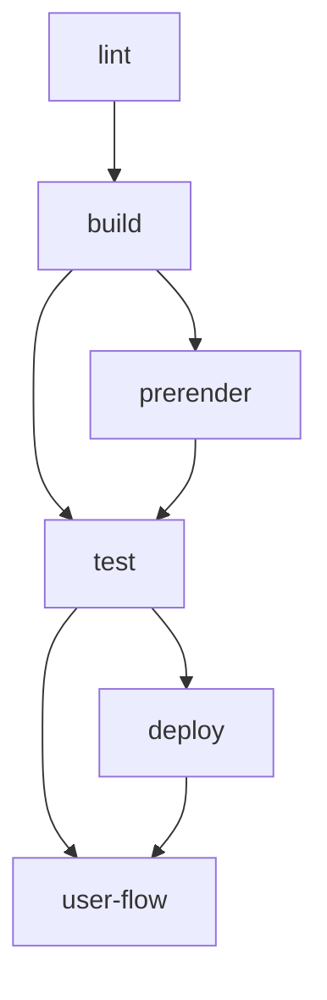
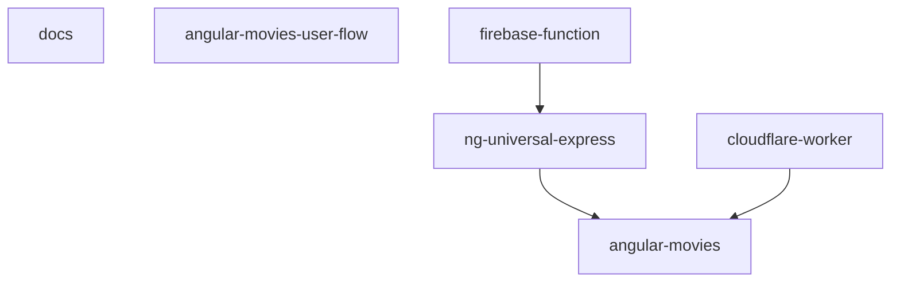

# General

## Commits

### Hooks

To set up commit hooks run `npm run prepare`.

### Message Standard

Commit lint is used to enforce the standard. The repositories commit message standard is defined
in `commit-lint.config.json`.

### Commit hooks

- commit-msg - executes `commitlint`
- pre-commit - executes `lint-staged`

## Task Hierarchy

## App Hierarchy

The repository maintains the following projects:

- angular-movies - a Angular application served in a web browser
- ng-universal-express - a node express server using `@nguniversal` for SSR and SSG of the angular-movies
- firebase-function - a firebase function used to execute SSR of the ng-universal-express in firebase functions
- cloudflare-worker - a cloudflare worker used to execute SSR of the angular-movies app in a worker

## Project Types

We consider the following types a archetypal project:

- Browser Application - maintaining an application served in the web e.g. Angular
- Angular Universal Express Application - maintaining a node express server for Angular and the related projects
- Firebase Function Application - maintaining a node function hosted on firebase cloud functions

# Tags

- docs - ["scope:shared", "type:util"]
- movies-user-flow - ["scope:shared", "type:util"]
- angular-movies - ["scope:client", "type:app"]
- ng-universal-express - ["scope:server", "type:app"]
- firebase-function - ["scope:server", "type:app"]
- cloudflare-worker - ["scope:server", "type:app"]

## Global Project Targets (`nx.json`)

In this mono repository we agree on a set of tasks that need to be consistent across the platforms:

### Tasks (`nx.json#targetDefaults`)

- **format** - defined in `prettierrc.json`
- **lint** - global linting
- **build** - build project for different reason
  - **development** - environments fast to build and easy to debug. No bundle budgets.
  - **production** - final build and. Bundle budgets used.
- **prerender** - prerender static pages of `movies` project for `deploy-hodting-*` tasks
- **serve** - serves for development and production build in a self hosted (emulated) environment
- **test** - project related tests (unit, integration) with optional postfix (if postfix is needed use `test-*`)
- **e2e** - e2e tests with optional postfix (if postfix is needed use `e2e-*`)
- **emulate** - emulated environments with optional postfix (if postfix is needed use `emulate-*`)
- **deploy** - deployment targets with optional postfix (if postfix is needed use `deploy-*`)
- **user-flow** - e2e tests inc lighthouse measures
  - **development** - environments fast to start and easy to debug. No perf measures.
  - **production** - environments close to the released version

### Caching Strategies (`nx.json#"tasksRunnerOptions#default#options#cacheableOperations`)

`nx` is used for local caching, `nx-cloud` for distributed caching.

The cacheableOperations are:

- lint
- build
- test
- prerender - only static pages are pre-rendered therefor we can cache it

# Projects (`nx.json#layout`)

## Docs

### Tasks

- **format** - Markdown specific formatting
- **lint** - adds `plugin:markdownlint/recommended`
- **build-report** - `state.json` and bundle analyzer generation
- **update-readme** - update the main readme (`./README.md`) with data from our builds and reports

## Browser Application

The browser application is needed to run host a CRS version of the application as well as all static files e.g.
pre-rendered pages or `routes.txt`

### Tasks

- **format** - base formatting
- **lint** - adds `@angular-eslint`, `@rx-angular/eslint-plugin`
- **build** - the executor `browser` from the package `@angular-devkit/build-angular` is used
  - **production**
  - **development**
- **serve** - the executor `dev-server` from the package `@angular-devkit/build-angular` is used
  - **production** - TODO
  - **development** - TODO
- **ngsw-config** - TODO
- **serve:ngsw** - TODO
- **emulate-firebase** - firebase hosting emulation over `firebase` CLI
- **deploy-firebase** - We deploy over a GH action. This is be used optionally.  
  It deploys the CSR version of the application excluding the pre-generated sites.
- **user-flow** - co-located e2e tests
  - **development** - `build` for `development`. `serve` it with the `development` option.  
    XY tests are executed with `--dryRun`.
  - **production** - `build` for `pruduction`. `serve` it with the `pruduction` option.  
    XY tests are executed.
  - **emulated** - `build` for `pruduction`. `serve` it with the `emulate-firebase` task.  
    XY tests are executed.
- **build-report** - `state.json` and bundle analyzer generation
- **update-readme** - update the main readme (`./README.md`) with data from our builds and reports

## Express Server

The ng-universal application is needed to run SSR in different environments e.g. function or edge.

### Tasks

- **format** - base formatting
- **lint** - adds `plugin:unicorn/recommended`
- **build** - the executor `server` from the package `@angular-devkit/build-angular` is used
  - **development** - TODO
  - **production** - TODO
  - **serve-production** - includes the automatic startup logic needed for `@nguniversal/builders:ssr-dev-server`
  - **serve-development** - includes the automatic startup logic needed for `@nguniversal/builders:ssr-dev-server`
- **serve** - the executor `ssr-dev-server` from the package `@nguniversal/builders` is used
  - **development** - TODO
  - **production** - TODO
- **pre-prerender** - precondition logic prerender e.g. preparation of `routs.txt`
- **prerender** - the executor `prerender` from the package `@nguniversal/builders` is used
- **emulate-firebase** - firebase hosting emulation over `firebase` CLI
- **user-flow** - co-located e2e tests
  - **development** - `build` for `development`. `serve` it with the `serve-development` options  
    XY tests are executed with `--dryRun`.
  - **production** - `build` for `pruduction`. `serve` it with the `serve-pruduction` options.  
    XY tests are executed.
  - **emulated** - `build` for `pruduction` and run `prerender`. `serve` it with the `emulate-firebase` task.  
    XY tests are executed.

## Cloud Function

The firebase-function application is needed to execute the ng-universal express server in a cloud function.

### Tasks

- **format** - base formatting
- **lint** - adds `plugin:unicorn/recommended`
- **build** - `tsc` is used directly
- **emulate-firebase** - firebase function emulation over `firebase` CLI
- **deploy-firebase** - We deploy over a GH action. This can be used optionally
  It deploys the firebase function as well as the CSR version including all pre-rendered pages of the application.
  The firebase CLI deploys hosting and functions.
- **user-flow** - co-located e2e tests
  - **emulated** - `build` for `pruduction` and run `prerender`. `serve` it with the `emulate-firebase` task.  
    XY tests are executed.

## Cloudflare Worker

The cloudflare-worker application is needed to execute the ng-universal express server in a edge worker.

### Tasks

- **format** - esm specific formatting
- **lint** - adds `plugin:unicorn/recommended`
- **build** - `tsc` is used directly
- **emulate** - cloudflare emulation over `wrangler` CLI
- **cloudflare-deploy** - We deploy over a GH action. This can be used optionally
  It deploys the worker as well as the CSR version including all pre-rendered pages of the application.
  The `wrangler` CLI deploys pages and worker.
- **user-flow** - co-located e2e tests
  - **emulated** - `build` for `pruduction`. `serve` it with the `emulate-firebase` task.  
    XY tests are executed.

## Movies User Flow

- **{centralized}-user-flows** - globally shared user-flow logic or tests
  - **test-data/index.ts** - global fixtures, data, budgets
  - **/src/index.ts** - configurable UFO objects entry point

The user-flows application is needed to execute e2e tests against the different deployments.

### Tasks

- **format** - exception rules for the different code parts
- **lint** - adds `plugin:unicorn/recommended`
- **build** - `tsc` is used directly

# CI

The CI has different actions:

- **`pr`** - `pull_request` on `main`
- **`m`** - `merge` on `main`

## Docs

- **`docs-hosting-pr+m.yml`** - runs on `m`

## Test and Build

- **`ci.yml`** - runs on `pr` and `m` --affected build,test,lint,prerender

### Firebase

#### Hosting

- **`firebase-hosting-m.yml`** - runs on `m` firebase-function:deploy + movies:user-flow:production,
- **`firebase-hosting-pr.yml`** - runs on `pr` ng-universal-express:deploy + ng-universal-express:user-flow:preview

#### Function

As the build will not break because of require usage we need to test against function emulator

- **`firebase-function-pr.yml`** - runs on `pr` firebase-function:build + firebase-function:user-flow:emulate,

### Cloudflare Hosting

- **`cloudflare-hosting-pr.yml`** - runs on `pr` cloudflare-worker:deploy + cloudflare-worker:user-flow:emulate,
