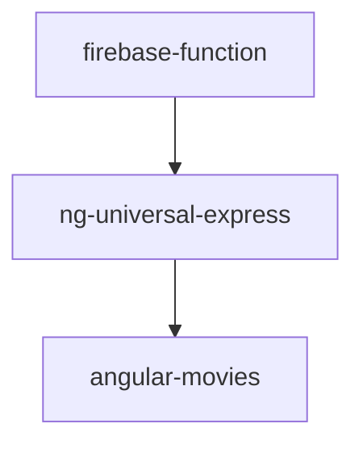

# General

## App Hierarchy

The repository maintains the following projects:

- angular-movies - a Angular application served in a web browser
- ng-universal-express - a node express server using `@nguniversal` for SSR and SSG of the angular-movies
- firebase-function - a firebase function used to execute SSR of the ng-universal-express in firebase functions

## Project Types

We consider the following types a archetypal project:

- Browser Application - maintaining an application served in the web e.g. Angular
- Angular Universal Express Application - maintaining a node express server for Angular and the related projects
- Firebase Function Application - maintaining a node function hosted on firebase cloud functions

## Project Targets

In this mono repository we agree on a set of tasks that need to be consistent across the platforms:

Tasks:

- **format**
- **lint** - defaults to `eslint`
- **build**
- **serve**
- **test**
- **e2e-* ** - e2e tests with optional postfix (if no postfix is needed use just `e2e`)
- **emulate-* ** - emulated environments
- **deploy-* ** - deployment targets

### Browser Application

The browser application is needed to run host a CRS version of the application as well as all static files e.g.
pre-rendered pages or `routes.txt`

Custom Tasks:

- **format**
- **lint**
- **build** - the executor `browser` from the package `@angular-devkit/build-angular` is used
  - production
  - development
- **serve** - the executor `dev-server` from the package `@angular-devkit/build-angular` is used
  - production
  - development
- **test**
- **e2e**
- **emulate-firebase-hosting** - firebase hosting emulation over `firebase` CLI
- **deploy-firebase-hosting** - We deploy over a GH action. This is be used optionally.  
  It deploys the CSR version of the application excluding the pre-generated sites.
- build-report - `state.json` and bundle analyzer generation
- update-readme - update the main readme (`./README.md`) with data from our builds and reports

### Express Server

The ng-universal application is needed to run SSR in different environments e.g. function or edge.

Custom Tasks:

- **format**
- **lint**
- **build** - the executor `server` from the package `@angular-devkit/build-angular` is used
  - production
  - development
  - serve-production - includes the automatic startup logic needed for `@nguniversal/builders:ssr-dev-server`
  - serve-development - includes the automatic startup logic needed for `@nguniversal/builders:ssr-dev-server`
- **serve** - the executor `ssr-dev-server` from the package `@nguniversal/builders` is used
  - production
  - development
- **serve-ngsw** - TODO
- **test**
- **e2e**
- **pre-prerender** - precondition logic prerender e.g. preparation of `routs.txt`
- **prerender** - the executor `prerender` from the package `@nguniversal/builders` is used
- **emulate-firebase-hosting** - firebase hosting emulation over `firebase` CLI
- **deploy-firebase-hosting** - we deploy over a GH action. This is be used optionally.
  It deploys the CSR version including all pre-rendered pages of the application.

### Cloud Function

The firebase-function application is needed to execute the ng-universal express server in a cloud function.

Custom Tasks:

- **format**
- **lint**
- **build** - `tsc` is used directly
- **test**
- **serve**
- **emulate-firebase-function** - firebase function emulation over `firebase` CLI
- **deploy-firebase-all** - We deploy over a GH action. This can be used optionally
  It deploys the firebase function as well as the CSR version including all pre-rendered pages of the application.
  The firebase CLI deploys hosting and functions.

### User Flows

!!TODO!!

The user-flows application is needed to execute e2e tests against the different deployments.

Custom Tasks and configuration sets:

- **user-flow**
  - CRS+SSG - over angular dev server
  - CRS+SSG - over ng-universal dev serve
  - CSR+SSG - over firebase hosting emulator
  - CSR+SSG - over firebase preview hosting
  - SSR+SSG - over firebase function emulator
  - CSR+SSG - over firebase live hosting
